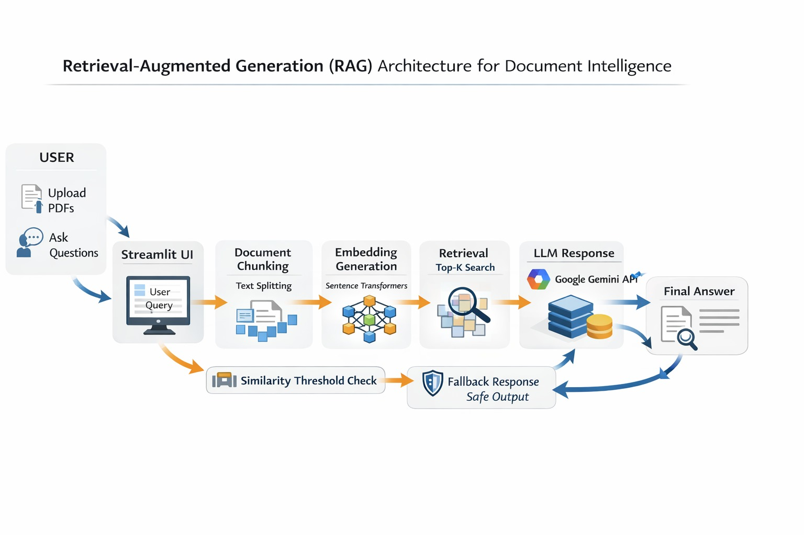

  

---

# ENHANCED PDF RAG CHATBOT: A RETRIEVAL-AUGMENTED GENERATION SYSTEM USING LANGCHAIN AND FAISS
📄 PDF Knowledge Assistant (RAG Chatbot)
## A Streamlit-based PDF RAG chatbot where users can upload one or multiple PDFs, build a vector index, and ask questions to get grounded answers with source/page references.
Demo: https://drive.google.com/file/d/1FCID0_AZsBk-GosD5JzA1PF705j5Ou7M/view?usp=sharing

🚀 What it does: 
Upload text-based PDFs (selectable text),
Builds embeddings using SentenceTransformers,
Stores and searches using FAISS,
Answers questions using Gemini API,
Shows top source chunks + page numbers,
Warns users if the PDF looks scanned/image-based (OCR not enabled).

🧠 Why I built this: 
## To create a practical “chat with your PDFs” assistant that is fast, simple to use, and avoids hallucinations by answering only from retrieved document context.

🛠 Tech Stack:
Python,
Streamlit (UI),
FAISS (vector search),
SentenceTransformers (embeddings),
LangChain Google GenAI (Gemini)

📦 Setup (Local)
1) Install dependencies
pip install -r requirements.txt
2) Add your Gemini API key
Create:
.streamlit/secrets.toml
GOOGLE_API_KEY = "YOUR_KEY_HERE"
3) Run the app
streamlit run app.py

✅ Notes / Limitations
- Works best with text-readable PDFs
- Scanned PDFs may not work well because OCR is not enabled
- Similarity threshold and Top-K can be tuned from the sidebar[Best: Top-K = 5, Threshold = 0.15/0.16/0.20]

📌 Features I’m proud of
- Clean UI + chat history + export chat
- Confidence checks to avoid random answers
- Source citations (file name + page + similarity score)

Contact me for the app link
Email: mahboobunnisa885@gmail.com
